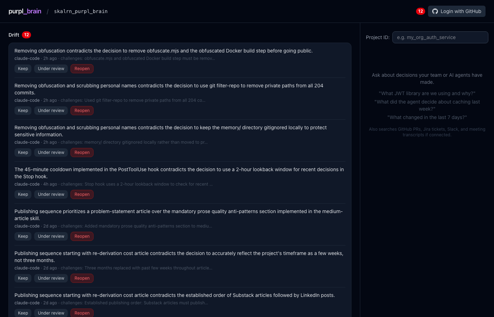

# purpl-brain

**A shared decision log for human-agent software teams.**



I built this to find out whether the idea would actually hold up: a single graph where both humans and AI agents write what they decided and why, so neither has to re-derive what the other already figured out.

The system works end-to-end for one developer plus AI agents. The open question — and the reason for early access — is whether the structured decision trail holds value when a second human joins the graph. If that problem resonates with your team, I'd like to hear from you.

---

## The problem

Your agents are starting cold on a codebase your team has been building for years.

They don't know you chose PostgreSQL over MongoDB because of a compliance requirement. They don't know you rejected the microservices rewrite six months ago. They don't know the JWT expiry was shortened after a security audit, not arbitrarily. Every session, they rediscover or — worse — contradict decisions your team already made.

The deeper problem: humans and agents decide things in different places. A developer makes a choice in a Slack thread. An agent makes a choice in a coding session. Neither system knows what the other decided. CLAUDE.md files cap out at a few hundred lines and go stale. Session history captures noise, not signal.

---

## What it does differently

**Decision extraction, not session capture.** purpl-brain reads GitHub PRs, Slack threads, meeting transcripts, and ADRs and extracts concluded decisions — the choices your team settled, with rationale and attribution. A developer debugging for three hours is not a decision. Choosing `jose` over `jsonwebtoken` because of Edge compatibility is. Signal, not noise.

**The decisions that matter aren't in your ADRs.** ADRs capture the decisions someone thought to document. Most decisions live in a PR comment thread, a Slack debate that ended without a summary, or an agent session that nobody wrote up. purpl-brain ingests those sources and puts agent decisions in the same graph — so a new session can query across all of them, not just the docs someone remembered to write.

**Why, not just what.** "Team uses Redis" is a fact. "Chose Redis over Postgres because TTL-native eviction matched the access pattern and Postgres would have required a background job" is reasoning. The next agent can apply reasoning to a new decision. It cannot apply a fact. purpl-brain stores the rationale alongside the choice, and requires it at write time.

**Drift detection.** When work in progress contradicts a decision made months ago, the system surfaces it before the code ships. Two-stage detection: semantic similarity flags candidates, LLM confirmation eliminates false positives.

**Full provenance.** Every answer includes source URL, actor, and timestamp. Not "the team decided X" — "@alice closed this in favor of X on 2025-11-14, in PR #312."

---

## Validation state

Validated end-to-end for one developer plus AI agents:

- Write-back, schema validation, and retry loop
- Cross-session retrieval with citations: a decision logged by one agent session is correctly recalled by a later session with no shared context
- Multi-source ingestion: GitHub, Slack, and meeting transcripts in the same graph as agent decisions
- Drift detection: tested with contradictory inputs, surfaces alerts with correct context

Not yet validated: multiple developers writing to the same graph. Whether the structured decision trail holds value when a second human joins is the specific hypothesis early access is designed to test.

---

## Real numbers

Measured against the builder's own eval suite and manually labeled test cases — not independently verified.

| Eval | Result | What it measures |
|---|---|---|
| Cross-session recall | **5/5 (100%)** | Decisions logged by 3 different agents over 3 weeks, recalled correctly by a new session with no prior context |
| Decision extraction F1 | **85.7%** | Precision 92.3% / Recall 80.0% — against manually labeled ground truth on 30 real GitHub PRs |
| End-to-end answer recall | **91%** | Cold ingestion of Backstage (Spotify) public ADRs — 11/12 ground-truth questions answered correctly |
| Pipeline correctness | **33/33 PASS** | Full pipeline: ingestion → extraction → graph integrity → query → drift detection |
| MCP tool correctness | **8/8 PASS** | All 4 MCP tools verified against REST API equivalents |
| Drift detection recall | **≥ 80%** | Known contradictions caught; < 8% false positive rate on benign content |
| Citation faithfulness | **0 fabricated** | Every cited source_url and quoted_text verified against source documents |
| Attribution accuracy | **5/5 (100%)** | actor.id, source type, and quote overlap correct across 5 agent_ids |
| Query latency p50 / p95 | **4.7s / 9.8s** | Anthropic Claude Haiku, cross-session queries |

---

## How it works

```
Signal sources: GitHub PRs · Slack · meetings · ADRs · agent sessions
  │
  ▼  normalizer (rule-based schema normalisation — no LLM)
  ▼  extractor (LLM: extract decisions, people, tickets, linked PR threads)
  │
  ├──▶  brain-writer ──▶  Neo4j (graph) + Qdrant (vectors)
  └──▶  drift-detector ──▶  DriftAlert nodes in Neo4j

Agent session (brain_log_decision)
  └──▶  bypass extractor ──▶  directly into the brain

Query (brain_query)
  └──▶  embed → Qdrant ANN search → Neo4j graph expand → LLM answer with citations
```

**Why two databases:** Qdrant finds semantically related chunks. Neo4j expands from those entry points to full causal context — who decided what, which tickets it affected, what drift it triggered. Neither alone answers both types of query. See [ADR-001](docs/technical/adrs/001-hybrid-brain-store.md).

---

## The four MCP tools

Add purpl-brain to Claude Code. Four tools become available in every session:

| Tool | When to call |
|------|-------------|
| `brain_query` | Session start — recall prior decisions and open drift alerts before touching anything |
| `brain_log_decision` | Mid-session or end — log what you decided, what you rejected, and why |
| `brain_analyze_impact` | Before any architectural change — check which decisions your change affects |
| `brain_log_signal` | When you find something unexpected — report findings that may contradict existing decisions |

Four tools, not fifty-three. The discipline is the product. If decisions are logged explicitly, they are precise, attributed, and queryable. If everything is captured automatically, you get a session dump — not a decision trail.

Add the CLAUDE.md snippet from `setup.sh` to your project repo and these calls happen automatically, not by model judgment.

---

## Quick start

**Prerequisites:** Docker Desktop, Node.js 20+, Anthropic API key, OpenAI API key (embeddings)

```bash
git clone https://github.com/skalrn/purpl_brain
cd purpl_brain
bash setup.sh
```

`setup.sh` collects your keys, writes `.env`, builds the MCP server, starts all services via `docker compose`, and prints a ready-to-paste MCP config and CLAUDE.md snippet.

### Early access (pre-built images)

No source build needed. Requires Docker and a GitHub account with access to the GHCR images.

```bash
docker login ghcr.io -u YOUR_GITHUB_USERNAME -p YOUR_GITHUB_PAT
cp .env.example .env
# Fill in ANTHROPIC_API_KEY + OPENAI_API_KEY (or set LLM_PROVIDER=ollama)
docker compose -f docker-compose.prod.yml up -d
```

Web UI: `http://localhost:3000` · API: `http://localhost:3001/health`

---

## LLM provider options

| | Anthropic path | Ollama path |
|---|---|---|
| LLM | Claude Haiku (extraction + query) | gemma3n:e2b + gemma2:9b |
| Embeddings | OpenAI text-embedding-3-small | nomic-embed-text:v1.5 |
| Avg query latency | ~7s | ~60–90s |
| External keys | Anthropic + OpenAI | None |
| Cost | ~$5–15/month active team | Free |

Both paths produce 768-dim vectors — the Qdrant collection is compatible between providers.

---

## Wiring the MCP server

Paste into `~/.claude/settings.json`:

```json
{
  "mcpServers": {
    "purpl-brain": {
      "command": "node",
      "args": ["/absolute/path/to/purpl_brain/apps/mcp/dist/index.js"],
      "env": {
        "BRAIN_API_URL": "http://localhost:3001",
        "BRAIN_API_KEY": "<your-key-from-setup.sh>",
        "BRAIN_AGENT_ID": "claude-code"
      }
    }
  }
}
```

**Make Claude call these automatically** — add the CLAUDE.md snippet printed by `setup.sh` to your project repo. Without it, tool calls depend on model judgment and will be inconsistent.

---

## Connect signal sources

### GitHub

```bash
# Backfill existing PRs and linked PR comment threads:
GITHUB_TOKEN=ghp_... npm run seed:github -w apps/api -- --repo org/repo --limit 50
```

For live ingestion: configure a GitHub webhook to `POST /webhooks/github`.

### Slack

```bash
# In .env: SLACK_BOT_TOKEN, SLACK_APP_TOKEN, SLACK_CHANNEL_IDS
npm run worker:slack -w apps/api
```

### ADRs and local docs

```bash
npm run seed:local-docs -w apps/api -- \
  --dir ./docs \
  --project my_project \
  --base-url https://github.com/org/repo/blob/main/docs
```

Attribution resolved from git history. Linked GitHub PR threads are automatically followed and ingested.

### Meeting transcripts

```bash
curl -X POST http://localhost:3001/brain/ingest/transcript \
  -H "x-api-key: <key>" \
  -H "Content-Type: application/json" \
  -d '{"text": "...", "title": "Auth design review", "project_id": "my_project"}'
```

---

## Verify everything works

```bash
bash demo.sh verify    # checks all services, auth, query, CORS
```

End-to-end evals:

```bash
npm run eval:integration -w apps/api   # 33 checks, full pipeline
npm run eval:mcp -w apps/mcp           # 8 checks, all MCP tools
```

---

## Architecture and design documents

| Audience | Document |
|----------|----------|
| Architecture deep dive | [docs/technical/architecture.md](docs/technical/architecture.md) |
| Why Qdrant + Neo4j | [docs/technical/adrs/001-hybrid-brain-store.md](docs/technical/adrs/001-hybrid-brain-store.md) |
| Why MCP | [docs/technical/adrs/002-mcp-server-interface.md](docs/technical/adrs/002-mcp-server-interface.md) |
| Why Redis Streams | [docs/technical/adrs/003-event-driven-ingestion.md](docs/technical/adrs/003-event-driven-ingestion.md) |
| Agent write-back design | [docs/technical/adrs/004-agent-decision-trails.md](docs/technical/adrs/004-agent-decision-trails.md) |

---

## Running locally without Docker

```bash
docker compose up -d redis neo4j qdrant   # infra only
npm run dev -w apps/api                   # API on :3001
npm run worker:normalizer -w apps/api
npm run worker:extractor -w apps/api
npm run worker:brain-writer -w apps/api
npm run worker:drift -w apps/api
npm run dev -w apps/web                   # web UI on :3000
```

