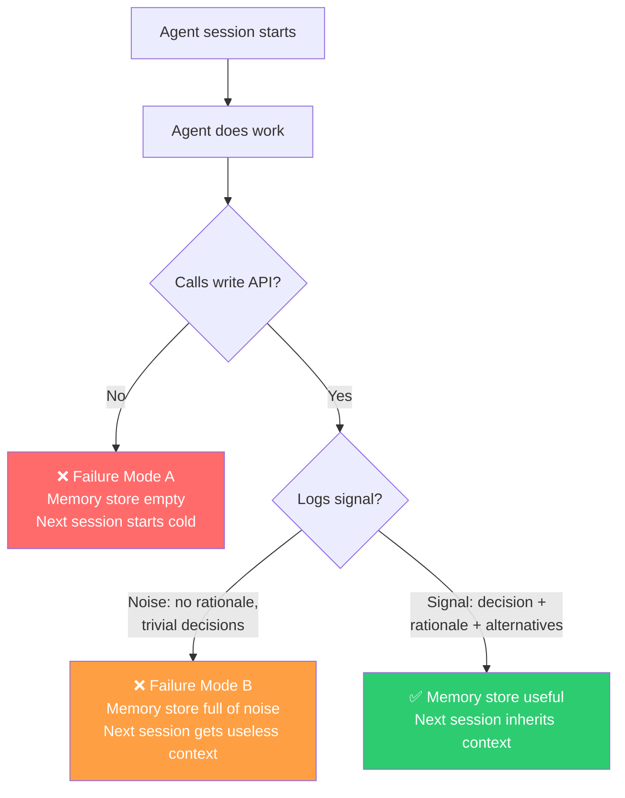
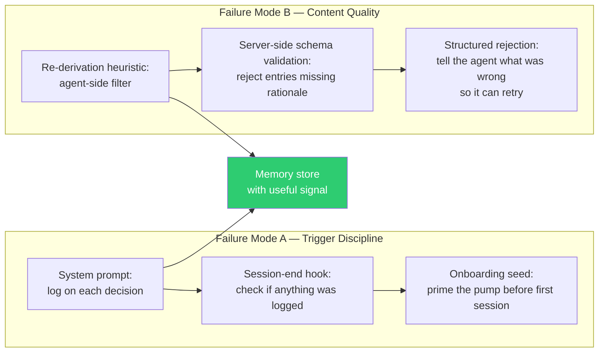

# 🛑 You Gave Your AI Agent a Memory Store. Here's Why It Still Forgets Everything.

*~7 min read*

---

Imagine you spend a week building shared persistent memory for your AI coding agents. Vector store, knowledge graph, write API, MCP read path — the works. You connect it to your agent. You run a session. The agent makes three significant decisions, writes them to the memory store, and the session ends cleanly.

You open a new session. You ask the agent what it decided last week. It has no idea.

You check the memory store. It's empty.

This is the article I wish existed before I built an agent memory system. There are two ways it can fail — and they require completely different fixes. Most teams don't discover the second failure mode until they've already solved the first.

---

## 1. 🏗️ The Problem Nobody Anticipates

When engineers design shared memory for AI agents, they spend almost all their time on the **storage problem**: how to embed decisions, how to structure the schema, how to retrieve relevant context at query time. These are real engineering challenges and they're solvable.

The problem that bites them in practice is not storage. It's **adoption**.

The agent has to call the write API. The information it writes has to be worth reading. Neither of these is guaranteed, and they fail in completely different ways.

**Failure mode A — Trigger discipline:** the agent never calls the write API at all. The memory store stays empty.

**Failure mode B — Content quality:** the agent calls the API faithfully, but logs the wrong things — no rationale, trivial decisions, missing alternatives. The memory store fills with noise.

An empty memory store is obviously broken. A memory store full of noise is much harder to diagnose — it looks like it's working until the next agent session tries to use it and gets useless context back.

<!-- Export as PNG from mermaid.live before importing to Medium -->


---

## 2. 🔕 Failure Mode A: The Agent Never Logs

The trigger discipline problem is straightforward in diagnosis and frustrating in practice. The agent session ends. No write call was made. Nothing is persisted.

This happens for several reasons, all of them mundane:

- The agent was not instructed to call the write API
- The session ended abruptly (timeout, crash, user closed the window)
- The developer is testing and skips logging to move faster
- The agent was configured with the write tool but never received a signal that the session was ending

The natural instinct is to solve this with a session-end hook — a shell command that fires when the session closes and triggers a logging prompt. This works as a **safety net**, but it has a subtle problem we'll get to in section 4.

### What actually works

The most reliable solution is to make logging a **mid-session behaviour**, not an end-of-session behaviour. The agent logs the moment a decision is made, not after all decisions are made.

This sounds like discipline work — just tell the agent to log more often. But it's actually enforced through the system prompt. A well-written instruction set defines exactly what triggers a log call:

- Choosing a library, pattern, or approach over alternatives
- Deciding **not** to do something — rejection decisions are decisions
- Discovering a constraint that will affect future work
- Any choice that, if unknown to the next session, would cause re-derivation or rework

The session-end hook then acts as a backup: it checks whether any decisions were logged during the session, and if not, prompts the agent to do a retrospective before closing. Two chances rather than one.

---

## 3. 📉 Failure Mode B: The Agent Logs, But Logs Noise

This failure mode is harder to see coming. The write API is being called. The memory store is growing. Everything looks healthy. But when the next session queries for prior context, it gets back something like:

> *"Previous session: used TypeScript. Used Postgres. Created a users table."*

These are facts, not decisions. They describe what was done, not why it was done or what was considered and rejected. The next session can't build on them. It has to re-derive from scratch — which is exactly what the memory system was supposed to prevent.

Content noise comes in three varieties:

**Too sparse** — the agent logs the action but not the reasoning. "Chose Redis" with no rationale. The next session doesn't know why Redis was chosen and can't tell whether that constraint still applies.

**Too verbose** — the agent logs every file edit, every config change, every minor implementation detail. The memory store fills with low-value entries that crowd out the high-value ones.

**Wrong granularity** — the agent logs implementation specifics instead of the choice *between approaches*. The interesting thing is not "set `maxConnections: 10`" — it's "chose connection pooling over request-scoped connections because of the concurrency model."

### The re-derivation test

The most useful heuristic for an agent deciding what to log is what I call the **re-derivation test**:

> *"If the next session starts cold with no memory of this session, would not knowing this cause it to redo work, make a conflicting choice, or hit the same dead end?"*

Anything that passes the test belongs in the memory store. Anything that doesn't — a specific implementation detail, a config value, a line of code — belongs in the code itself. The code is already the record of what was done. The memory store is the record of *why*.

---

## 4. 🔀 Why These Failure Modes Need Different Solutions

It's tempting to think: "I'll solve both with a better prompt." Write better instructions. Tell the agent to log everything meaningful. Problem solved.

This doesn't hold in practice. Failure mode A (no logging) and failure mode B (noisy logging) pull in opposite directions. Instructions aggressive enough to guarantee logging tend to produce over-logging. Instructions that filter carefully tend to produce under-logging. You need separate enforcement mechanisms for each.

<!-- Export as PNG from mermaid.live before importing to Medium -->


The key insight: **content quality enforcement belongs on the server, not in the prompt**.

A server-side validation layer that rejects entries missing required fields — rationale, alternatives considered — does something a prompt cannot: it creates a **feedback loop**. The agent calls the write API, gets a structured rejection with a reason, and retries with a better entry. One round-trip is enough to force a higher-quality log. The prompt sets the intention; the API enforces the contract.

---

## 5. ⏱️ The Timing Problem Nobody Mentions

There's a subtle reason end-of-session logging is a bad primary strategy, beyond the crash/close risk.

By the time an agent session ends, the context window is full of *later* work. A decision made in step 3 of a 30-step session is compressed and summarized by step 30. The agent's memory of *why* it made that early decision — the alternatives it considered, the constraint it was working around — has been partially overwritten by everything that came after.

Mid-session logging captures the reasoning while it's still explicit. The agent logs "chose connection pooling because of the concurrency model" in the moment that choice was made, when the tradeoff analysis is fresh in context. End-of-session logging asks the agent to reconstruct that reasoning retroactively, from a compressed memory of a session it's already mostly forgotten.

**This is a quality argument, not just a reliability argument.** Mid-session logging doesn't just increase the probability of getting a log — it increases the quality of the log you get.

The practical implication: the session-end hook should be a **safety net for missed mid-session calls**, not the primary write path.

---

## 6. 🔒 Server-Side Quality Gates

The schema validation layer deserves a concrete example. Here's what a minimal rejection response looks like:

```json
{
  "error": "VALIDATION_FAILED",
  "failures": [
    {
      "field": "decisions[0].rationale",
      "reason": "rationale is required and must be at least 20 characters"
    },
    {
      "field": "decisions[0].alternatives_considered",
      "reason": "at least one alternative must be documented, even if only to record what was rejected"
    }
  ],
  "retry_hint": "Describe why this choice was made and what else was considered before retrying."
}
```

The `retry_hint` field is not decoration. It gives the agent enough information to produce a valid entry on the second attempt without re-querying for the schema definition. One round-trip, not two.

The fields that are worth validating are:

✅ **`rationale`** — required, minimum token threshold. The single most valuable field in any decision log.

✅ **`alternatives_considered`** — at least one entry required. Even "considered X, rejected because Y" with one sentence per alternative is enough.

✅ **`description`** — must differ meaningfully from the action taken. "Used Redis" as a description is an action. "Chose Redis over Postgres for the revocation list to get TTL-native eviction" is a decision.

❌ **`confidence`** — don't validate this. Agents will set it to `"high"` to pass validation. Let it be optional.

❌ **`files_modified`** — don't validate this. It's additive metadata, not load-bearing information.

---

## 7. 🔭 Observations and Limitations

**Server-side validation adds a round-trip.** For interactive sessions, one retry is imperceptible. For automated pipelines that batch-write at session end, a validation failure blocks the write until the retry succeeds. Design the retry flow to be non-blocking.

**The re-derivation test requires the agent to model a hypothetical future session.** This is a non-trivial inference. Agents will sometimes pass decisions that fail the test (noise) and fail decisions that pass it (missed logs). The test reduces the error rate — it does not eliminate it.

**Auto-extraction from transcripts is a last resort, not a substitute.** If a session produces no log, running an extraction pass over the transcript recovers the *what* (what was done) but frequently loses the *why* (the reasoning behind it). A transcript that says "let me check... okay I'll use Redis" does not contain the tradeoff analysis. Flag auto-extracted entries as lower confidence.

**Validation thresholds need calibration.** A 20-character minimum on `rationale` is a starting point, not a specification. The right threshold depends on the domain and the agent's verbosity. Start conservative and raise it if the memory store fills with barely-passing entries.

---

## 💡 Key Takeaways

- 🧱 **The storage problem and the adoption problem are different problems.** Most teams solve storage first and discover adoption much later. Design for both from the start.
- 🔀 **Trigger discipline and content quality are separate failure modes** that pull in opposite directions — they need separate solutions, not a single prompt.
- ⏱️ **Mid-session logging is a quality argument, not just a reliability argument.** The reasoning behind early decisions gets compressed out of context by session end. Log while the tradeoff is still explicit.
- 🔒 **Content quality enforcement belongs on the server.** Schema validation with a structured rejection and retry hint creates a feedback loop that prompts cannot.

---

<!-- MEDIUM IMPORT INSTRUCTIONS
1. Render both Mermaid diagrams at https://mermaid.live — export each as PNG.
2. Use Medium's import feature: Profile → Stories → Import a story. Do NOT paste markdown directly.
3. After import, insert the PNG diagrams at the positions marked by the ```mermaid blocks (delete the code block, insert the image).
4. Tables have been replaced with bullet groups — no manual conversion needed.
5. Suggested tags: AI Engineering, Software Architecture, Machine Learning, Developer Tools, Agents
-->
