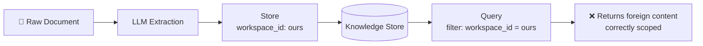
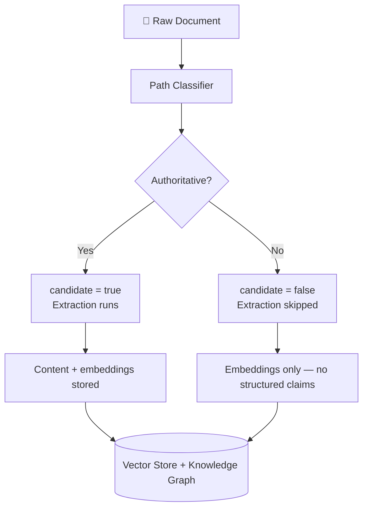
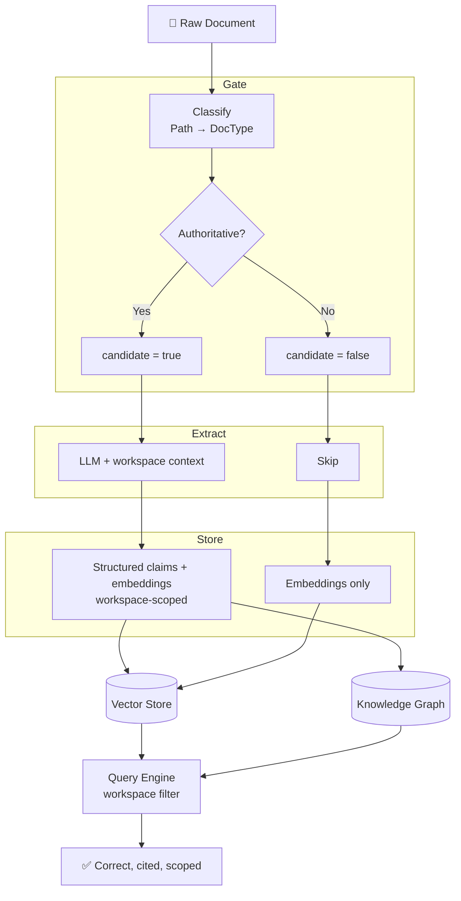

# 🚨 Your Team's AI Tool Just Cited the Wrong Company's Policy. Everything Worked Correctly.

---

Imagine asking your team's AI assistant: *"What's our database compression policy?"* It returns a confident answer with a link to a markdown file in your repository as the source. You click the link — the file is real, the workspace is yours, the answer reads exactly like something your team would write.

The policy it describes belongs to a completely different project. It appeared as an example inside a demo script your team wrote six months ago. Your AI assistant read it, believed it, and stored it as your team's own.

You check the database — the data is correctly scoped to your workspace. You check the query layer — the filter is running. You check the ingestion logs — no errors. Everything worked exactly as designed. And yet your team is one question away from acting on someone else's technical policy as if it were their own.

This is the failure mode that makes AI extraction pipelines different from traditional systems. It does not look like a bug. The standard fix — filter at query time — does nothing. And it will not surface until someone asks the right question at the wrong moment.

This article covers why it happens, why the obvious fix fails, and the two-layer solution that actually closes it.

---

## 1. 🔍 Why This Is Different From the Same Bug in Traditional Systems

In a traditional search system, indexing a demo script that references another project just means that project's name appears in results. This is arguably correct — the document is in your workspace and it mentions that project. The retrieval is transparent about what it returned.

In an AI extraction pipeline, the failure is qualitatively different:

- The LLM finds content stated clearly in the document.
- It extracts structured facts and attributes them to your workspace.
- They pass every downstream filter — workspace ID, source URL, confidence score.
- They appear in responses with valid citations pointing to real files.
- They are wrong.

The LLM is not hallucinating. It found real content and extracted it faithfully. The bug is in what you asked it to extract, not how. That distinction is what makes this failure nearly invisible: the system behaves correctly at every stage and still produces wrong answers.

---

## 2. 🛑 Why the Obvious Fix Fails

<!-- DIAGRAM 1: Replace with image exported from mermaid.live before importing to Medium -->


The instinct is to add a workspace filter at the query layer. Standard multi-tenant isolation — filter by workspace identifier at read time.

It does not help. The foreign content is already stored under your workspace identifier at write time. The query filter cannot distinguish between:

- Content your team produced, stored correctly.
- Content another project produced, mentioned in your demo script, stored incorrectly.

Both carry the same workspace ID. **Read-time filtering assumes write-time correctness.** When the write path has a structural flaw, no query filter recovers from it.

The fix has to happen before the LLM sees the document.

---

## 3. 🧱 The Two-Layer Solution

Complete isolation requires two layers working together. Neither is sufficient alone.

**Layer 1 — Classify:** Gate on document type before extraction.
- ✅ Solves: non-authoritative doc types (demo, pitch, review)
- ❌ Misses: authoritative docs that quote other projects

**Layer 2 — Context:** Pass workspace context to the extraction prompt.
- ✅ Solves: cross-project references in any doc
- ❌ Misses: nothing, when combined with Layer 1

**Both together:** closes all known contamination paths.

**Layer 1 without Layer 2** handles the obvious case but is fragile at the boundary — an architecture doc that cross-references another project's approach still contaminates.

**Layer 2 without Layer 1** is correct but expensive — you pay LLM cost on every demo script and pitch deck just to confirm there is nothing to extract.

---

## 4. 🗂️ Layer 1 — Classify Before Extraction

Not all documents are authoritative sources of your workspace's knowledge.

**✅ Authoritative — extraction runs:**
- `adr` → `docs/adrs/**`
- `architecture` → `docs/technical/**`, `*implementation-plan*`
- `prd` → `docs/product/**`, `roadmap*`, `vision*`
- `runbook` → `onboarding*`, `setup*`, `docs/ops/**`

**❌ Non-authoritative — extraction skipped:**
- `demo` → `docs/demo/**`
- `pitch` → `docs/pitch/**`, `docs/interview/**`
- `review` → `docs/review/**`, `risk-register*`
- `unknown` → everything else (conservative default)

Classification runs on the file path before the document enters the extraction stage:

<!-- DIAGRAM 2: Replace with image exported from mermaid.live before importing to Medium -->


Non-authoritative documents are still embedded and stored — discoverable via semantic search — but no structured claims are written. The contamination surface is zero, not reduced.

### Classifier implementation

An if/else chain is order-dependent in ways not visible from the code. A declarative rule table separates data from logic — adding a type is a one-line change, the function never changes:

```typescript
const PATH_RULES: Array<[RegExp, DocType]> = [
  [/(?:^|\/)adrs?\//, "adr"],
  [/(?:^|\/)demos?\//, "demo"],
  [/(?:^|\/)(?:pitch|sales|interview)\//, "pitch"],
  [/(?:^|\/)(?:review|retro(?:spective)?)\/|risk-register/, "review"],
  [/(?:^|\/)(?:runbook|ops)\/|onboarding|setup/, "runbook"],
  [/(?:^|\/)(?:technical|design)\/|implementation-plan/, "architecture"],
  [/(?:^|\/)product\/|\/prd\b|roadmap|vision|personas/, "prd"],
];

function classifyDocType(relPath: string): DocType {
  const p = relPath.replace(/\\/g, "/").toLowerCase();
  return PATH_RULES.find(([re]) => re.test(p))?.[1] ?? "unknown";
}
```

**Effect:** Anything unmatched defaults to `unknown` — non-authoritative. A missed extraction is recoverable. A wrong claim stored as fact is invisible until it produces a wrong answer.

---

## 5. 🧠 Layer 2 — Project-Aware Extraction

Layer 1 handles the structural case: documents that are entirely non-authoritative by type. Layer 2 handles the semantic case: authoritative documents that quote, cite, or reference other projects.

The extraction prompt without context:

```
Extract structured insights from this document.
Content: {content}
```

With workspace context:

```
Extract insights made by or for {workspace_name}: {one_line_description}.
If the document quotes or references content from other projects
as examples or prior art — do not extract those.
Content: {content}
```

**Effect:** The LLM now has the information to distinguish "something this team produced" from "something mentioned in this document." Layer 1 handles the easy case at zero cost. Layer 2 handles the boundary case at LLM cost. Together they close the loop.

---

## 6. ⚙️ Full Pipeline

<!-- DIAGRAM 3: Replace with image exported from mermaid.live before importing to Medium -->


---

## 7. ⚠️ Observations and Limitations

**Path classification is a heuristic.** A team that stores an ADR under `docs/examples/` gets a wrong classification. The rule table covers standard conventions; non-standard structures need per-workspace configuration — storing the rules in workspace settings and exposing them via API is the correct long-term design.

**Frontmatter is an escape hatch, not a requirement.** Authors can declare `type: demo` in YAML frontmatter to override path classification for individual files. This should never be required at scale — per-doc discipline does not hold across a growing team.

**Layer 2 is not yet standard practice.** Most extraction pipelines do not pass workspace context to the LLM. This is the gap that makes the failure hard to find — the extraction looks correct in isolation and wrong only at query time.

---

## 8. 💡 Key Takeaways

- 🗂️ **Classify before you extract.** The LLM does not know what kind of document it is reading. Make that decision upstream.
- ✍️ **Fix contamination at write time.** Read-time filters assume correct writes. They cannot recover from a structural flaw in the write path.
- 🛡️ **Default to non-authoritative.** A missed extraction is recoverable. A wrong claim stored as fact is invisible until it matters.
- 🧱 **Two layers do different work.** Classification is a structural gate — zero cost, handles obvious cases. Workspace context is a semantic filter — LLM cost, handles edge cases. Both are necessary.

These are not new principles. The application to AI extraction pipelines is what is less documented — and where the cost of missing them is higher and the failure quieter than in traditional systems.

---

<!-- 
MEDIUM IMPORT INSTRUCTIONS
===========================
1. Render Mermaid diagrams at https://mermaid.live — export each as PNG.
2. In Medium: click your profile photo → Stories → Import a story.
3. Import this .md file — headings, code blocks, tables, and bold text import correctly.
4. Replace the mermaid code blocks with the exported PNG images.
5. Set the title to: "Your Team's AI Tool Just Cited the Wrong Company's Policy. Everything Worked Correctly."
-->
