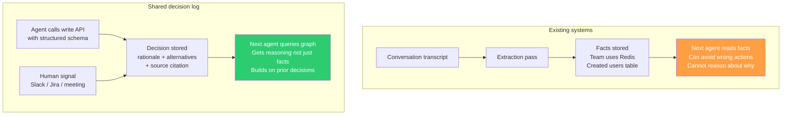
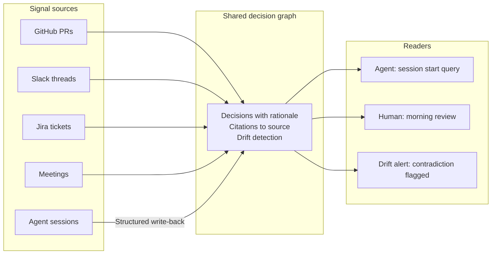

# I Built a Shared Decision Log for Human-Agent Teams. Here's the Gap That Made It Worth Building.

*~7 min read*

---

Last year I integrated Mem0 into an agent session and ran a test. The agent spent forty minutes reasoning through a service architecture decision: three alternatives evaluated, one chosen, two explicitly rejected with reasons. The session ended. I queried the memory store. It returned: "Team uses Redis. Team uses PostgreSQL."

The agent had made a decision. The memory store had captured facts. Those are not the same thing.

Mem0 is not broken. It does exactly what it was designed to do: extract salient information from conversation turns and store it for retrieval. The problem is that the reasoning behind a decision is not salient in the same way a fact is. "Redis was chosen over PostgreSQL because Redis TTL-native eviction matched the revocation list's access pattern" doesn't survive a general-purpose extraction pass. What survives is "team uses Redis."

This article covers what I built to address that gap, how it differs from Mem0, Zep, and Microsoft Foundry Agent Memory, what's been validated end-to-end, and the specific question I need early users to help answer.

---

## 1. 🗂️ What Existing Agent Memory Systems Do Well

The three most prominent agent memory systems today are Mem0, Zep, and Microsoft Foundry Agent Memory. Each solves a real problem and solves it well.

**Mem0** intercepts at the application layer. You pass raw conversation turns; it runs an extraction pass and writes to a dual-store (vector plus graph). The April 2026 algorithm scores 94.4 on LongMemEval. Write-back coverage is near-100% by construction because the write path doesn't go through the agent at all. This is a meaningful engineering advantage.

**Zep** uses a temporal knowledge graph. It tracks when a fact was true and when it was superseded, with bi-temporal tracking that records both the valid time and the transaction time of every stored entity. It scores 71.2% overall on LongMemEval and handles relationship invalidation automatically. For systems where knowing *when* something changed matters as much as knowing *what* changed, Zep's temporal model is more sophisticated than anything else in the space.

**Microsoft Foundry Agent Memory** shipped in December 2025 as part of Foundry Agent Service. It automatically extracts, consolidates, and retrieves context across agent sessions with no custom embedding database required. For Azure-native teams, it provides cross-session continuity out of the box.

These systems are not wrong. They are built for a specific problem: helping an agent remember what happened in previous sessions. For that problem, they work.

---

## 2. 🔍 The Two Gaps None of Them Fill

The problem I kept running into is not the one these systems solve. It's two related but distinct gaps.

### Gap 1: Facts are captured. Reasoning is not.

All three systems use some form of automatic extraction from conversation transcripts. Extraction captures what was done. It does not reliably capture why it was done, what alternatives were evaluated, or what constraint shaped the choice.

A transcript that says "let me check... okay, I'll use Redis" doesn't contain the tradeoff analysis. An extraction pass over that transcript produces "team uses Redis." The downstream consequence: an agent that reads "team uses Redis" can avoid proposing a migration to MySQL. It cannot reason about whether a new service should also use Redis, because it doesn't know why Redis was chosen.

### Gap 2: Agents don't write back. And humans don't exist.

Mem0, Zep, and Foundry Agent Memory are agent-scoped: one agent, across sessions. None of them have a write path where an agent explicitly logs a decision with structured rationale and alternatives considered. The extraction pass handles writes automatically.

More significantly: none of them have a human write path. A decision made in a Slack thread, a Jira ticket, or a design meeting is invisible to these systems. The agent's memory and the team's memory remain separate silos. An agent starting a session inherits what previous agents did. It does not inherit what the humans on the team decided.

<!-- Export as PNG from mermaid.live before importing to Medium -->


---

## 3. ⚙️ What a Shared Decision Log Does Differently

The system addresses both gaps with a different architecture at each layer.

### Write-back: structured, not extracted

Instead of running an extraction pass over conversation transcripts, the agent calls a write API explicitly. The schema requires a description of the decision, a rationale for why it was made, and at least one alternative that was considered and rejected. A server-side validation layer rejects entries that don't meet those requirements and returns a structured error the agent can act on. The agent retries with a better entry.

**Effect:** this produces a qualitatively different record. "Chose Redis over PostgreSQL because TTL-native eviction matches the revocation list's access pattern; Postgres would have required a background job to expire keys" is a decision. "Team uses Redis" is a fact. Both are retrievable. Only one enables the next agent to reason about whether the same choice applies to a new service.

### The graph: shared, not agent-scoped

The same graph that agents write to also ingests signals from GitHub, Slack, Jira, and meeting transcripts. A developer who decides something in a Slack thread and an agent that decides something in a coding session both write to the same graph. Any actor (human or agent) queries the same source.

The practical consequence: an agent starting a new session can retrieve not just what previous agents decided, but what the engineering lead decided in a design discussion last Thursday. Without anyone manually copying context between systems.

### Drift detection: decisions, not files

When a new signal contradicts a prior decision (an agent choosing an approach that conflicts with a Slack thread from two weeks ago), the system flags the contradiction before it lands. The developer sees which prior decision is affected, what session produced it, and which source it traces to. That's a different kind of alert than a code review comment: it surfaces the history of why the prior decision was made, not just that something changed.

<!-- Export as PNG from mermaid.live before importing to Medium -->


---

## 4. ✅ What's Been Validated

The system runs end-to-end for a solo developer working with AI coding agents.

The write-back mechanism works. Agents using the MCP interface call the write API mid-session when they make significant decisions. The validation layer rejects low-quality entries and the retry produces a better record. Queries at the start of new sessions retrieve prior decisions with citations.

A concrete example from real usage: an agent spent time reasoning through a worker startup ordering constraint: consumer groups must be created before workers start consuming, because Redis silently drops events published to a stream with no consumer group registered. That constraint was logged mid-session. The next session that touched the same code queried the graph, retrieved the constraint in one call, and didn't re-derive it. That's the loop working.

The multi-source ingestion works. GitHub events, Slack messages, and Jira tickets flow through the pipeline and land in the same graph as agent decisions. A natural language query returns citations that span sources: a query about an architectural decision might return an agent log, a PR comment, and a Slack thread as the grounding evidence.

Drift detection works at the level of contradictions between agent decisions. When tested with deliberately contradictory inputs, the system surfaces the alert with the right context and the right citations.

---

## 5. ❓ The Open Question

Everything above has been validated with one developer working with their own agents. The system has not been used by a second person.

The open question is specific: **does the structured decision trail hold its value when a second human joins the graph?**

The hypothesis is that it does. A developer joining a project mid-stream should be able to query the graph and get a grounded account of why the architecture looks the way it does, what was considered and rejected, and what constraints are still active. That hypothesis has not been tested with a real second person.

A related question: does the write-back discipline hold across two developers who don't share a system prompt? One developer can be disciplined about logging decisions because they set up the system. A second developer installs the MCP server and their agents start writing. Are the entries they produce consistent enough in quality to be useful alongside existing logs? Unknown.

These are the questions I'm looking to answer with early users. If you're running AI agents on a software team and the context-loss problem resonates, I'd like to hear from you. The system works for one developer. I need to find out whether it works for two.

---

## Key Takeaways

- **Existing agent memory systems capture facts, not reasoning.** Automatic extraction from conversation transcripts produces what was done, not why it was decided. For decisions that require context, the store looks full but isn't useful.
- **The human write path is missing from every existing system.** Agent memory and team memory are separate silos in Mem0, Zep, and Foundry. A Slack thread and an agent session don't end up in the same graph.
- **Structured write-back with server-side validation produces a different class of record.** A schema that requires rationale and alternatives, enforced by the API rather than a prompt, produces decisions rather than facts.
- **The open question is team scale.** The system works end-to-end for one developer. Whether the structured decision trail holds its value when a second human joins the graph is what needs to be learned from early users.

---

<!-- MEDIUM IMPORT INSTRUCTIONS
1. Render both Mermaid diagrams at https://mermaid.live — export each as PNG.
2. Use Medium's import feature: Profile → Stories → Import a story. Do NOT paste markdown directly.
3. After import, insert the PNG diagrams at the positions marked by the ```mermaid blocks (delete the code block, insert the image).
4. Suggested tags: AI Engineering, Software Architecture, Machine Learning, Developer Tools, AI Agents
-->
