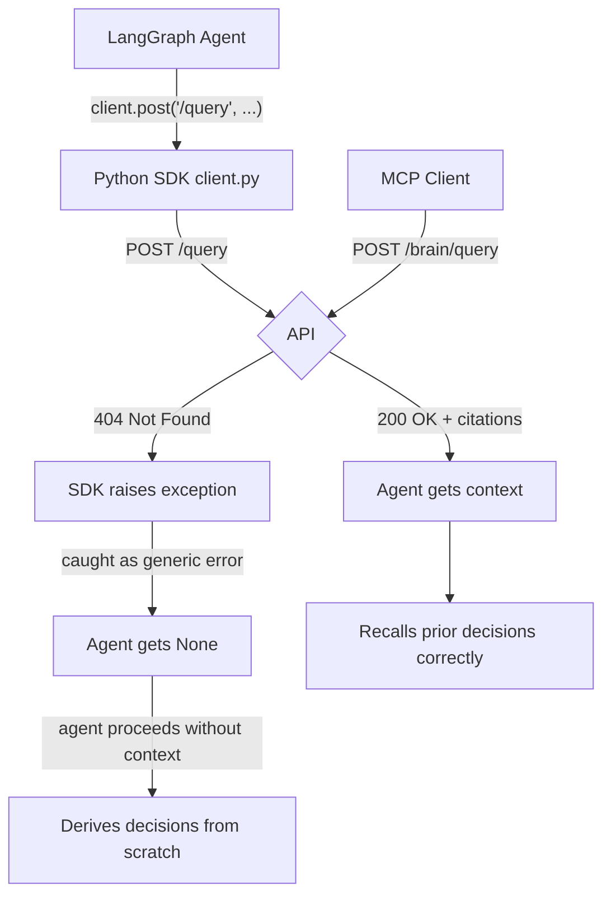

# The One-Line Bug That Proved the Agent Memory System Didn't Work

---

I built this system around one core promise: an AI agent in one tool can log a decision, and a completely different AI agent in a completely different tool can recall it later — without anyone copying context between them.

I had evals. A cross-session recall test that passed at 80%. An MCP smoke test. A drift detection eval, a citation accuracy eval, a project isolation eval.

Then, reviewing the full codebase, I found this:

```python
# tools_langgraph.py, line 37
result = client.post("/query", {"query": text, "project_id": project_id})
```

The API route is registered at `/brain/query`. Every LangGraph and Google ADK agent using the Python SDK was getting a 404 on every single brain query. The core product promise — cross-agent, cross-tool memory recall — was completely broken for half the SDK surface. Had been broken since the file was first written.

None of the evals caught it.

This article is about what that miss reveals, why it happens so easily in agent infrastructure, and what an eval suite that actually catches it looks like.

---

## 1. 🔍 Why This Particular Bug Is Easy to Miss

The MCP path worked correctly. The TypeScript MCP server called the right URLs. The cross-session eval seeded decisions via the REST API directly and queried via the REST API directly. The eval suite never touched the Python SDK.

The SDK existed in a completely separate package (`packages/python/`) with its own client and tool wrappers. It was tested with a smoke test that verified the SDK could be imported and that the tool schemas looked right. It was not tested by actually calling the API through the SDK and verifying a non-404 response.

From the eval suite's perspective, everything worked. From the perspective of a LangGraph agent trying to recall a prior session's decisions, nothing worked.

This is the specific trap in agent infrastructure testing: the system has multiple integration paths (MCP, REST, Python SDK, TypeScript SDK) and they each exercise different code. A test that covers one path tells you nothing about the others. The paths share a backend, but the clients calling that backend are all separate codebases with separate URL string literals.

---

## 2. 🛑 The Failure Mode That Hides in Plain Sight

<!-- DIAGRAM 1: Replace with image exported from mermaid.live before importing to Medium -->


The failure is invisible in the logs from the agent's perspective. The SDK throws an exception that the tool wrapper catches. The LangGraph tool returns an error string. The agent sees "brain_query failed" or gets a None and carries on. It doesn't know it was supposed to get institutional memory — it just knows the tool didn't work this time.

This is categorically different from a database that returns a wrong answer. A wrong answer at least proves the system is connected. A 404 means the system never connected at all, and nothing in the agent's behavior visibly changes — it just re-derives context from scratch the way it would have before the memory system existed.

You can run the product for weeks with this bug active and the user's experience is: "the memory thing doesn't seem to help much." Not "it's broken." Just quietly not useful.

---

## 3. 🧪 What an Eval Suite That Catches This Looks Like

The fix for the URL bug is trivial:

```python
# Before
result = client.post("/query", {...})

# After  
result = client.post("/brain/query", {...})
```

The interesting question is what eval catches it. The answer is not "a unit test that mocks the HTTP client." A mocked client would pass with the wrong URL — the mock doesn't care what path you call. The answer is an integration test that:

1. Starts the actual API server
2. Calls the Python SDK's `brain_query` tool with a real query against a real project
3. Asserts the response has an `answer` field that is not empty and has at least one citation

```python
# eval_sdk_integration.py
def test_brain_query_via_sdk():
    tools = langgraph_tools(client)
    brain_query = next(t for t in tools if t.name == "brain_query")
    
    result = brain_query.invoke({
        "query": "What database did we choose for semantic search?",
        "project_id": TEST_PROJECT_ID
    })
    
    assert result.get("answer"), "brain_query returned no answer"
    assert len(result.get("citations", [])) > 0, "brain_query returned no citations"
    assert result.get("latency_ms", 0) > 0, "brain_query did not reach the API"
```

This test would have caught the bug immediately because it would have received a 404, which the SDK would have surfaced as an exception, which would have failed the assertion.

The same test pattern applies to every SDK path:

- `brain_log_decision` — assert the returned `event_id` is non-empty and the decision is queryable afterward
- `brain_analyze_impact` — assert the returned `overall_risk` is one of the expected enum values
- `brain_log_signal` — assert `drift_alerts_created` is an integer (even if 0)

Four tests. One for each tool. Against a real running API. They cover the entire SDK surface in under five minutes.

---

## 4. 📋 The Multi-Path Testing Rule for Agent Infrastructure

Every agent system has this structure:

```
Backend (the actual logic)
    ↑ called by
Multiple client paths (MCP / REST / Python SDK / TypeScript SDK / ...)
    ↑ used by
Multiple agent runtimes (Claude Code / Cursor / LangGraph / ADK / ...)
```

The backend can be perfectly correct. Each client path can have bugs that the backend's tests will never surface. The standard software engineering instinct — "we tested the backend, the clients are just thin wrappers" — breaks down here because the "thin wrappers" contain URL strings, parameter names, authentication headers, and response parsing code that all vary independently.

The rule that follows: **every distinct client path needs at least one end-to-end smoke test that calls the real backend and asserts a real response.** Not a mock. Not a unit test of the client class. A real call that would fail if the URL were wrong, if the auth header were missing, or if the response parsing were broken.

For purpl_brain that means four tests in a `eval_sdk_integration.py` file that runs against a live stack. The total cost is a few minutes of CI time per build. The alternative cost is weeks of users wondering why the memory system "doesn't seem to help much."

---

## 5. 🔒 What This Reveals About Agent Memory Testing Specifically

Agent memory systems have a uniquely subtle failure mode: they can fail silently in a way that looks like "working but not very useful" rather than "broken."

A memory system that returns a 404 on every query produces an agent that re-derives context from scratch every session — which is exactly what the agent did before the memory system existed. The experience degrades to the baseline. Users shrug and move on. The system never crashes. Logs show errors if you look, but nothing alerts.

This is why the core promise eval — seed a decision from Agent A, query from Agent B with no shared context, verify recall — has to be the first thing that runs in CI and the first thing that fails when something breaks. It's the canary for the whole system. If that test passes, the product works. If it fails, the product doesn't work even if every other component is green.

Build that test first. Run it on every commit. Everything else is optional until it passes.

---

*This article is part of a series on building agent memory infrastructure. The findings that inspired it came from a full-codebase review of purpl_brain, a shared cross-agent memory system for software engineering teams.*
