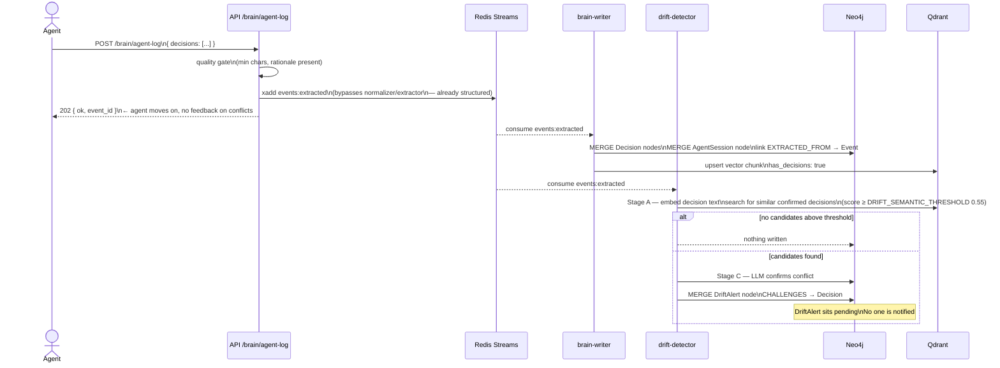
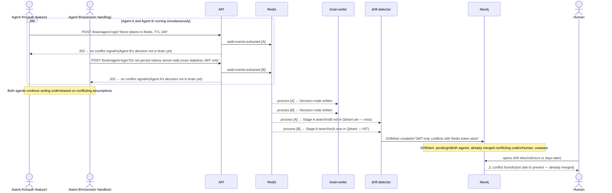
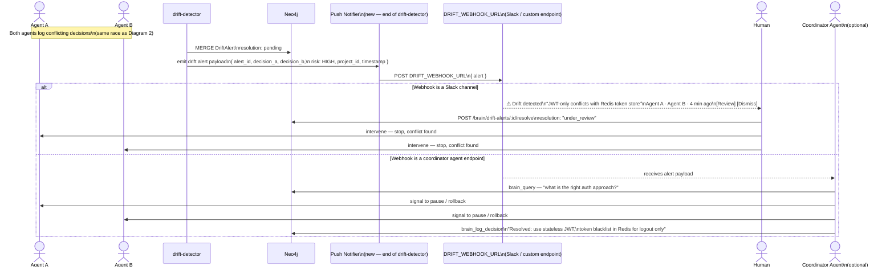
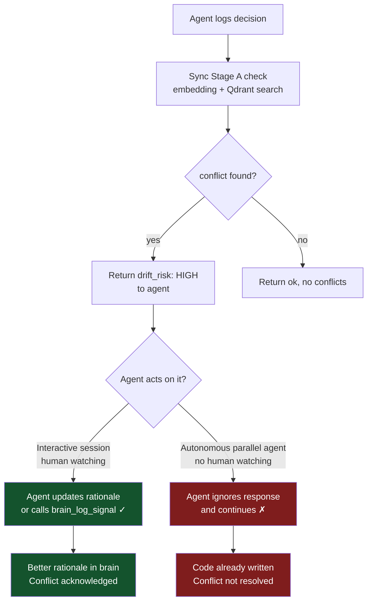

# Drift Detection Flow

Three diagrams — read in order.

1. **Single agent, happy path** — what exists today
2. **Parallel agents, conflict** — the ICP problem
3. **Proposed: push notification** — what closes the loop

---

## 1. Current pipeline — single agent, no conflict



**Gap:** the agent that created the conflict never learns about it. The DriftAlert exists in Neo4j but is only visible if a human opens the web inbox — or if the next agent session loads the `brain://project/...` MCP resource snapshot.

---

## 2. Parallel agents — the ICP problem



**The problem:** the race window between two parallel agents means neither gets conflict feedback in time. By the time the DriftAlert is created, both agents have moved on. The human only sees the conflict when they check the inbox, which may be hours after the damage is done.

---

## 3. Proposed fix — push notification on DriftAlert creation



**What changes in code:**

```
drift-detector.ts — after writeDriftAlert():
  if (DRIFT_WEBHOOK_URL) {
    fetch(DRIFT_WEBHOOK_URL, {
      method: "POST",
      body: JSON.stringify({
        alert_id, project_id, risk,
        challenging_summary, challenged_decision_summary,
        timestamp: new Date().toISOString()
      })
    })
  }

.env.example — add:
  DRIFT_WEBHOOK_URL=        # POST target for drift alerts (Slack incoming webhook, custom URL)
```

One env var. One fetch call. No new infrastructure.

---

## Why not sync Stage A in brain_log_decision?



Sync Stage A is useful for **interactive sessions** where a human can respond to the feedback.
For parallel autonomous agents — your ICP — it adds latency and the feedback is not acted on.
Push notification on DriftAlert creation is the right primitive for the ICP.

---

## Summary: what to build and when

| Mechanism | Solves | When |
|---|---|---|
| Push notification on DriftAlert (`DRIFT_WEBHOOK_URL`) | Cross-agent conflict, parallel agents, ICP | Beta |
| Drift inbox UI (web) | Human review + resolve workflow | Beta |
| `brain_analyze_impact` as hard pre-flight | Single-agent pre-commit check | Beta (CLAUDE.md enforcement) |
| Sync Stage A in `brain_log_decision` | Rationale quality in interactive sessions | Post-beta, nice-to-have |
| Coordinator agent endpoint | Fully autonomous conflict resolution | Post-beta |
